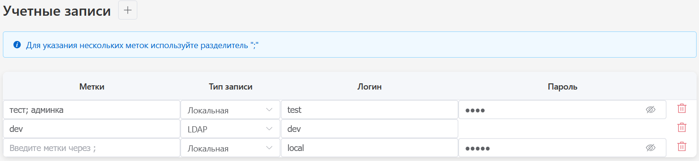

# веб-приложение для управления учетными записями

## интерфейс веб-приложения:

## Основные возможности:
- добавление учетных записей
- поддержка двух типов записей: локальная и LDAP
- ввод меток через разделитель ";"
- автоматическое преобразование меток в массив объектов
- валидация обязательных полей
- автосохранение при потере фокуса
- удаление записей
- сохранение данных в localStorage

## Стек:
Vue 3 + TypeScript + Pinia + Element Plus + Vite

## Запуск проекта
	npm install
	npm run dev
	
### веб-приложение будет доступно по адресу: http://localhost:5173